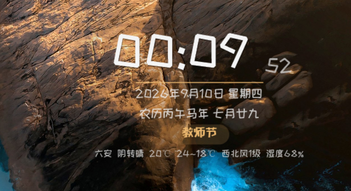

# 🕐 DesktopClock

A clean, elegant **desktop clock widget for Windows**. It shows the Gregorian date, the Chinese lunar calendar, weekday, festivals, solar terms, and live weather. Low memory footprint (~24 MB private working set) and **no runtime to install** — just download and double-click.



> Note: the app UI is in Chinese, and the weather source is a Chinese weather service (best for Chinese cities).

## ✨ Features

- 🕐 **Large clock time** — optional seconds, gradient + shadow text, font size 28–240
- 📅 **Gregorian + weekday + Chinese lunar calendar** — lunar date, sexagenary cycle (干支) and zodiac
- 🎏 **Festival / solar-term badge** — Chinese lunar festivals, Gregorian festivals, Qingming, and the 24 solar terms shown automatically
- 🌤 **Weather** — from weather.com.cn (free, **no API key**), auto-refreshes every 30 minutes: current temperature, high/low, wind, humidity
- 🎨 **Highly customizable** — fonts (bundled open-source font), font size, text / accent / background colors, background opacity, **live preview**
- 📐 **Flexible layout** — 8 position presets + remember-my-position; position lock, always-on-top, click-through
- ⚙️ **Runs your way** — auto-start on boot, tray icon, right-click menu, double-click tray to open settings
- 🧩 **Font plug-in** — drop any `.ttf` into the `fonts` folder and it appears in the font list

## 📥 Download

Grab the latest `DesktopClock.exe` from the **Releases** page and double-click it.

- Requires **.NET Framework 4.x** (pre-installed on Windows 10/11)
- No installer, no dependencies

## 🖱 Usage

| Action | What it does |
|---|---|
| **Left-drag** | Move the clock (position is remembered; disabled when locked) |
| **Right-click the clock** | Menu: Settings / Lock / Always-on-top / Click-through / Weather / Auto-start / Exit |
| **Right-click the tray icon** | Same menu |
| **Double-click the tray icon** | Open settings |

> After enabling **click-through**, the clock ignores the mouse — use the tray icon to control it.

## ⚙️ Settings (live preview)

- **Appearance** — font presets (clean / classic / kai / hei / fangsong / dengxian / happy), independent time & info fonts, time size, text / accent / background color, background opacity, show seconds
- **Layout** — 8 position presets + remember position, position lock, always-on-top, click-through
- **Weather** — show/hide, a dropdown of 40+ major Chinese cities with autocomplete, city-name search (auto-resolves the city code), or manual name + code
- **General** — auto-start on boot

## 🌤 Weather

- Data from **weather.com.cn** (free, no key), refreshed every 30 minutes
- Three ways to pick a city: major-city dropdown, city-name search, or manual city code
- If the network fails, the weather line is simply hidden — the clock keeps working

## 📂 Project structure

```
DesktopClock/
├── DesktopClock.exe       ← the app (double-click to run)
├── src/                   ← source code
│   ├── Program.cs         ← main program (UI / logic / settings)
│   ├── Calendar.cs        ← Chinese lunar calendar & solar terms
│   └── Test.cs            ← lunar algorithm self-test
├── scripts/               ← build scripts
│   ├── build.bat          ← compile DesktopClock.exe
│   └── make-icon-from-clock.ps1  ← generate app.ico from clock.png
├── fonts/                 ← fonts (drop a .ttf to add it to the list)
├── app.ico                ← application icon
├── clock.png              ← icon source image
└── DesktopClock.ini       ← config file (auto-generated)
```

## 🔨 Build from source

1. Install .NET Framework 4.x (usually already on Windows 10/11);
2. Run `scripts\build.bat` (uses the built-in `csc.exe` compiler — no extra dependencies);
3. It produces `DesktopClock.exe`.

## 🛠 Tech stack

- **C# / WinForms** (.NET Framework 4.x)
- **Layered window** for per-pixel transparency; GDI+ anti-aliased rendering
- Plain-HTTP weather data to avoid SSL fingerprint blocking on some networks

## 📄 License

[MIT](LICENSE) © [GG-0407](https://github.com/GG-0407)
